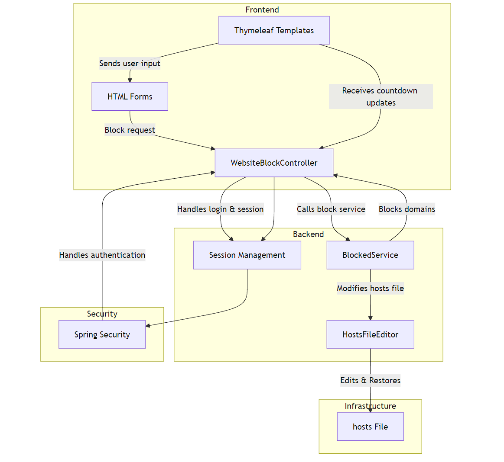

# EPSI Workshop_24_25

# Fig - Social Media Time Management Application

## 1. Presentation of the Application
   Fig is a web-based application designed to help users manage and limit the time they spend on social media platforms. The app allows users to block access to certain websites (such as Instagram and Facebook) for a specified duration, providing a mechanism for better time management and focus. During the block period, users are redirected to a page within the application, showing a countdown and offering optional entertainment content.

## 2. Features
- <b>Blocking Social Media Websites</b>: Users can select specific websites (e.g., Instagram, Facebook) and block access for a custom duration (in minutes or hours).
- <b>Countdown Timer</b>: Once a site is blocked, a countdown timer is displayed, showing the remaining block time.
- <b>Persistent Sessions</b>: The application keeps track of blocked websites per user session.
- <b>Host File Management</b>: Fig modifies the hosts file on the user’s machine to block access to the selected websites. Before making changes, the app creates a backup of the hosts file and restores it when the block period ends.
- <b>Unblocking and Time Expiration</b>: Once the block duration has expired, access to the blocked websites is automatically restored.

## 3. Technical Architecture
   <b>Frontend</b>: Thymeleaf is used as the templating engine for dynamic rendering of pages like the block screen and social media selection.
   <b>Backend</b>: Spring Boot provides the core framework for routing, request handling, and managing sessions.
   <b>Service Layer</b>: A dedicated service (BlockedService) manages the logic for modifying the hosts file and scheduling the unblock after the block period.
   <b>Persistence</b>: While session data is stored in-memory during runtime, future versions can integrate a database for longer-term tracking and analytics.
   <b>Security</b>: Spring Security can be optionally configured to protect routes and manage user sessions.
   <b>Network Control</b>: The application leverages file I/O and system-level commands to edit the hosts file for blocking social media platforms on the network level.
   



# Developer's Documentation

## Cloning the Repository

To clone the Fig repository, run the following command:

```bash
git clone https://github.com/mohamedaminenadim/epsi-workshop_24_25
```

Make sure you have `git` installed on your system. If you do not have it installed, you can download it from [git-scm](https://git-scm.com/).

Navigate into the project folder:

```bash
cd fig
```

## Maven Lifecycle

### Build

To build the project, use the following Maven command:

```bash
mvn clean install
```

This will clean the previous build and install the project's dependencies.

### Running the Application

To run the application, execute:

```bash
mvn spring-boot:run
```

This will start the Spring Boot application.

### Packaging

To package the application as a `.jar` file, run:

```bash
mvn clean package
```

The jar file will be generated in the `target` directory. You can run it using:

```bash
java -jar target/fig-<version>.jar
```

Replace `<version>` with the current version of the project.

### Testing

To run the test cases, execute the following Maven command:

```bash
mvn test
```

### Dependencies

This project uses Maven as the build automation tool. The main dependencies are:

- **Spring Boot**: For creating a RESTful application
- **Thymeleaf**: As the template engine
- **Pcap4j**: For packet capture to block social media sites
- **Spring Security**: To manage authentication and security

All dependencies are defined in the `pom.xml` file.

## Important Maven Commands

Here are some additional Maven commands you may find useful:

- **Validate**: `mvn validate` - Validate if the project is correct and all necessary information is available.
- **Compile**: `mvn compile` - Compile the source code of the project.
- **Test**: `mvn test` - Run tests using a suitable unit testing framework.
- **Clean**: `mvn clean` - Cleans the project by deleting the target directory.
- **Verify**: `mvn verify` - Runs any checks to verify the package is valid.
